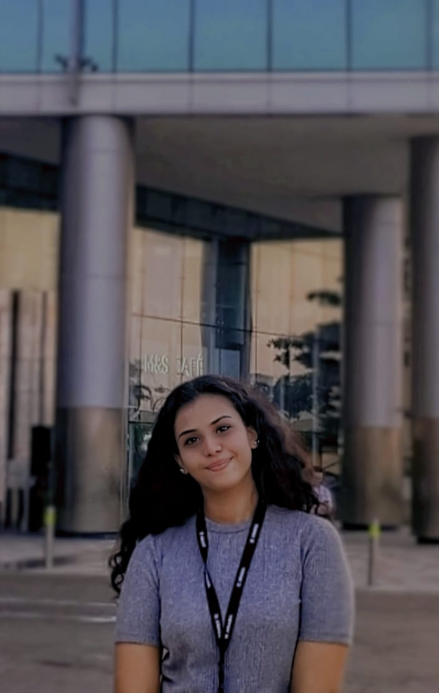

<!DOCTYPE html>
<html lang="en">
<head>
    <meta charset="UTF-8">
    <meta name="viewport" content="width=device-width, initial-scale=1.0">
    <title>Vismaya's Portfolio</title>
    
</head>
<body>
    <header>
        Vismaya Vinod | Cybersecurity & Development Enthusiast
    </header>
    <section>
        

            <h2>Welcome to My Portfolio</h2>
            
Passionate about cybersecurity, programming, and innovation.

            

                
                

                    <h3>About Me</h3>
                    

                        I am a dedicated BTech student at VIT University, Bhopal, specializing in Cyber Security and Digital Forensics.
                        With a passion for computer programming and cyber security, I excel in communication and teamwork, thriving in collaborative environments. 
                        My goal is to leverage my technical skills and academic knowledge to contribute to the field of Cybersecurity and digital forensics.
                        Currently, I am broadening my skill set by learning new courses and am eager to connect with professionals and peers to further explore the engineering community's possibilities.
                    

                    <a href="https://www.linkedin.com/in/vismaya-vinod-nair-20a01a252/" target="_blank">Visit my LinkedIn</a>
                

            

            <h3>Skills</h3>
            <table>
                <tr>
                    <th>Technology</th>
                    <th>Proficiency</th>
                </tr>
                <tr>
                    <td>Python & Java</td>
                    <td>Advanced</td>
                </tr>
                <tr>
                    <td>Web Development</td>
                    <td>Intermediate</td>
                </tr>
                <tr>
                    <td>Cybersecurity</td>
                    <td>Expert</td>
                </tr>
            </table>
            <h3>Projects</h3>
            <ul>
                <li>App Development [CYPICS]</li>
                <li> Coverless Steganography</li>
            </ul>
            <h3>Certifications</h3>
            <ul>
                <li>AI Essentials (Google)</li>
                <li>Cybersecurity Specialization (Google)</li>
                <li>Introduction to Cybersecurity (Cisco)</li>
                <li>Ethical Hacking Essentials (EC-Council)</li>
                <li>OOPs Concepts in C++ (Great Learning)</li>
            </ul>
            <h3>Work Experience</h3>
            

                <h4>Cybersecurity Intern</h4>
                
<strong>Company:</strong> Arada Developments, Dubai 
                <strong>Role:</strong> Cybersecurity Intern 
                <strong>Responsibilities:</strong> Conducting vulnerability assessments, implementing security measures, and assisting in developing cybersecurity policies.

          <h4>Creative Team Core Member</h4>
                
<strong>Organization:</strong> Mozilla Firefox Club, VIT Bhopal 
                <strong>Role:</strong> Creative Team Core Member 
                <strong>Responsibilities:</strong> Contributing to creative aspects of club events, including design and content creation for promotional materials.

                <h4>Media & Marketing Team Co-Lead</h4>
                
<strong>Organization:</strong> Cyber Warriors, VIT Bhopal 
                <strong>Role:</strong> Media & Marketing Team Co-Lead 
                <strong>Responsibilities:</strong> Leading the media and marketing efforts for club events, managing social media presence, and creating promotional content.

            

            <h3>Contact Me</h3>
            <form>
                <input type="text" placeholder="Your Name" required>
                <textarea placeholder="Your Message" required></textarea>
                <button type="submit">Submit</button>
            </form>
            <h3>Media</h3>
            <video controls width="300">
                <source src="media/dubai.mp4" type="video/mp4">
                Your browser does not support video.
            </video>
        

    </section>
    <footer>
        &copy; 2024 Vismaya Vinod | All Rights Reserved
    </footer>
</body>
</html>
